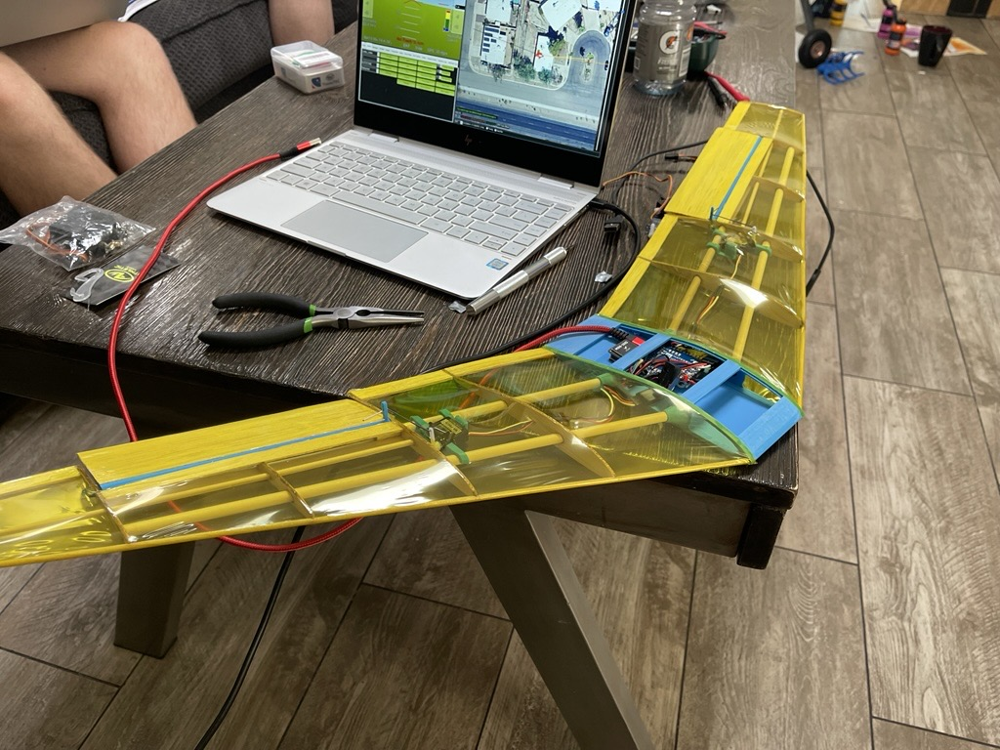
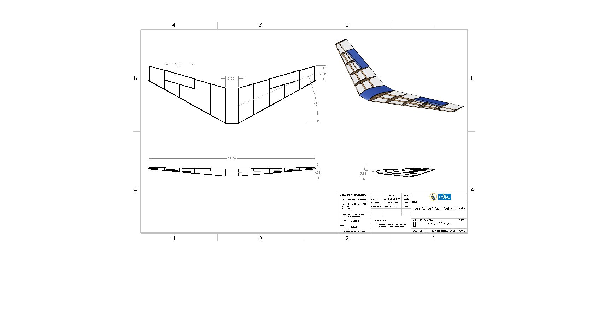
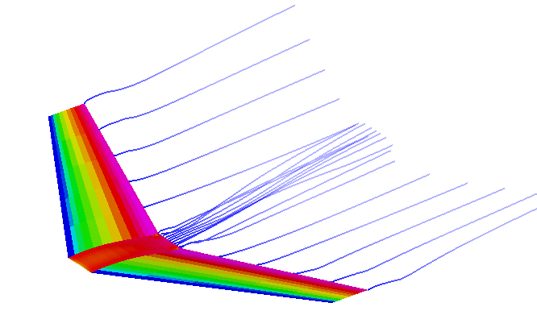

# X-1 Test Vehicle (AIAA Design/Build/Fly 2025)

## Overview

This project involved the design, analysis, fabrication, and testing of the X-1 Test Vehicle for the 2025 AIAA Design/Build/Fly (DBF) competition. The objective was to develop a lightweight autonomous glider capable of being safely carried beneath a competition aircraft and reliably released during flight while satisfying competition-defined structural, geometric, and operational requirements.

My primary responsibilities included the mechanical design of the glider, structural analysis through finite element analysis (FEA), fabrication, and development of the release mechanism used to deploy the vehicle from the carrier aircraft.

---

## Project Requirements

The competition required the X-1 test vehicle to:

* Remain below the maximum allowable weight
* Be securely attached during takeoff, flight, and landing
* Be command-released from the carrier aircraft
* Transition to stable gliding flight following release
* Execute an autonomous flight profile after deployment
* Operate within the dimensional and packaging constraints defined by the competition rules

---

## My Contributions

* Designed the glider structure and mechanical layout in SolidWorks.
* Performed finite element analysis (FEA) to evaluate structural performance and guide weight reduction.
* Fabricated structural components and assembled the test vehicle.
* Designed and tested the release mechanism to provide consistent and reliable deployment from the carrier aircraft.
* Participated in prototype testing and iterative design improvements based on flight evaluations.

---

## Design Objectives

The design emphasized:

* Lightweight construction
* Structural efficiency
* Reliable release from the carrier aircraft
* Stable post-release flight characteristics
* Manufacturability and ease of assembly

---

## Mechanical Design

The glider was designed using an iterative engineering process balancing aerodynamic performance, structural integrity, and competition constraints.

Key design considerations included:

* Structural stiffness
* Weight optimization
* Center of gravity
* Mounting interface
* Release mechanism integration
* Manufacturability

---

## Structural Analysis

Finite element analysis (FEA) was performed to evaluate critical structural components under expected loading conditions.

Analysis focused on:

* Wing bending
* Structural deflection
* High-stress regions
* Weight reduction opportunities

Simulation results informed multiple design revisions prior to fabrication.

.png)

---

## Aerodynamic Analysis

Aerodynamic performance was evaluated using **VSPAERO** to assess the flight characteristics of the X-1 test vehicle prior to fabrication. Computational analyses were performed throughout the design process to guide geometry refinement and verify that the glider would achieve stable, efficient flight following release from the carrier aircraft.

Simulation results were used to evaluate:

* Lift and drag characteristics
* Lift-to-drag (L/D) ratio
* Static longitudinal stability
* Angle of attack effects
* Control surface effectiveness
* Flight trim and glide performance

The aerodynamic analysis informed iterative modifications to the wing geometry, tail configuration, and center of gravity, helping balance stability, controllability, and glide efficiency while satisfying the competition's weight and packaging constraints.

---

## Release Mechanism

A mechanical release system was developed to securely retain the glider during takeoff and flight while enabling reliable deployment upon pilot command.

Design objectives included:

* Positive retention
* Low release force
* Repeatable operation
* Minimal added weight
* Compatibility with the carrier aircraft

---

## Manufacturing

Prototype components were fabricated and assembled using lightweight construction methods suitable for competition aircraft.

Manufacturing activities included:

* Precision assembly
* Structural bonding
* Mechanical fitting
* Flight testing and refinement

---

## Lessons Learned

This project strengthened experience in:

* Aircraft mechanical design
* Structural analysis (FEA)
* Lightweight structures
* Prototype fabrication
* Mechanical system integration
* Engineering design iteration
* Team-based product development

---

## Technologies Used

### CAD & Analysis

* SolidWorks
* Finite Element Analysis (FEA)

### Manufacturing

* Composite Fabrication
* Mechanical Assembly
* Prototype Development

### Engineering

* Aircraft Design
* Structural Design
* Mechanical Design
* Design Optimization
